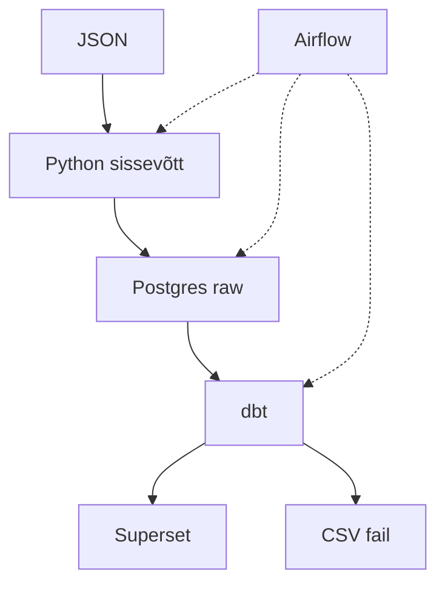

# Vahekohtumehhanismid Euroopa Komisjoni koondumisotsustes

Alates 2000. aastate algusest on Euroopa Komisjon oma tingimuslikes koondumisotsustes kasutanud vahekohtuklausleid. Nende puhul on võimalik, et koondunud ettevõtte kohustuste jõustamine ei ole tegelikkuses konkurentide jaoks võimalik või viib kuluka protsessini.  

Antud projekt ehitab Euroopa Komisjoni avalike koondumisotsuste andmestiku põhjal andmevoo vahekohtuklauslite statistika kuvamiseks dashboardile.  

## Äriküsimus
  
Mitmes vaadeldava perioodi Euroopa Komisjoni tingimuslikus koondumisotsuses (artiklid 6(1)(b) ja 8(2)) on kaalutud tingimuste jõustamiseks vahekohtumehhanismi ning milline on selliste otsuste sektoraalne jaotuvus ja trend (NACE-koodide alusel).  

Kasu tõuseb: 

•	teadlastele, kuna seda andmestikku sellise granulaarsusega seni ei eksisteeri (tuleb sadu pdfe käsitsi avada ja analüüsida); 

•	investoritele investeeringut plaanides riskide hindamiseks (nt kas tingimuste üle tekkivad vaidlused on pigem avalikud või konfidentsiaalsed; kas võimalik vaidluste lahendamise mehhanism ise võib olla Euroopa õigusega vastuolus);

•	turuosalistele, sh VKE-dele, Komisjoni koondumismenetluse raames turu-uuringule vastates vaidluste lahendamise mehhanismi osas teadlike valikute tegemiseks; 

•	regulaatoritele hindamaks vahekohtuklauslite kasutamise sagedust ja selle praktika võimaliku muutmise eeldatavat mõju kogu Euroopa turule ja selle eri sektoritele.

**Mõõdikud:**

1. Kalendrikuu või slideriga valitud muu perioodi tingimuslikult heakskiitvates koondumisotsustes vahekohtumehhanismi mainimine, jah/ei näitaja.  
2. Vahekohtumehhanismi mainivate otsuste koguarv ja osakaal kõigist tingimuslikult heakskiitvatest otsustest kuude/aastate lõikes.  
3. Millistes NACE tegevusalades on kaalutud vahekohtumehhanismi?  
4. Milline on trend tegevusalati kuude/aastate/muu valitud perioodi lõikes?  


## Arhitektuur


```mermaid
flowchart TB
    ec[JSON]
    py[Python sissevõtt]
    raw[Postgres raw]
    dbt[dbt]
    ss[Superset]
    csv[CSV fail]
    af[Airflow]

    ec --> py --> raw --> dbt --> ss
    dbt --> csv
    af -.-> py
    af -.-> raw
    af -.-> dbt
```

Täpsem kirjeldus: [`docs/architecture.md`](docs/architecture.md) · [`docs/data_pipeline.md`](docs/data_pipeline.md)


## Andmestik

| Allikas | Tüüp | Uuendamine | Roll |
|---------|------|--------------|------|
| https://compcases-open-data-portal-files-prod.s3.eu-west-1.amazonaws.com/case-data-M.json |JSON | Uueneb otsuste/info lisandumisel (fail uueneb iga päev, kuna tavaliselt lisandub iga kuu mitukümmend otsust - nt 27. mai 2026 seisuga on viimasel kuul Komisjon teinud koondumistes 37 menetluses uusi otsuseid) | Algallikas |


## Stack

| Komponent | Tööriist |
|-----------|---------|
| Sissevõtt | Python |
| Transformatsioon | dbt Core 1.10 |
| Andmehoidla | PostgreSQL (pgDuckDB) |
| Dashboard | Apache Superset 6.x |
| Orkestreerimine | Apache Airflow 3.x  |


## Käivitamine

Pikem käskude nimekiri (käsitsi sammud, andmete analüüs, dbt, Superset, Airflow, restart): [`docs/run_commands.md`](docs/run_commands.md)

```bash
# Keskkonnamuutujate kopeerimine
cp .env.example .env

# Kõik teenused (db, python, dbt, superset, airflow-init, Airflow UI + scheduler)
docker compose up -d --build
docker compose ps   # oota "healthy" / "running" (esimene Airflow init võtab mõne minuti)

# Airflow
# UI: http://localhost:8080  (login: .env → AIRFLOW_ADMIN_USER / AIRFLOW_ADMIN_PASSWORD)
# Lülita sisse ja käivita DAG "eu_merger_arbitration" (esimesel korral pdf failide protsessimise aeg ca 3h)
# Kiire test 100 PDF-i töötlemiseks: DAG "eu_merger_arbitration_test"

### Dashboardi ZIP import
docker compose exec python python superset/import_dashboard.py
```
Ava **http://localhost:8088** → **Dashboards**.


# Peatamine
```bash
docker compose down
```

## Saladused ja konfiguratsioon

Kõik saladused (paroolid, API võtmed, andmebaasi URL-id) on `.env` failis. Repos on ainult `.env.example`, mis näitab vajalike muutujate struktuuri ilma tegelike väärtusteta.

Vajalikud muutujad:

| Muutuja | Tähendus | Näide (`.env.example`) |
|---------|----------|------------------------|
| `POSTGRES_USER` | Pipeline'i Postgres kasutaja (`db` teenus) | `user` |
| `POSTGRES_PASSWORD` | Pipeline'i Postgres parool | `user` |
| `POSTGRES_DB` | Pipeline'i andmebaasi nimi | `eu-merger-arbitration` |
| `SUPERSET_SECRET_KEY` | Superset sessiooni krüptovõti | `dev-only-change-me` |
| `SUPERSET_ADMIN_USER` | Superset admin kasutaja | `admin` |
| `SUPERSET_ADMIN_PASSWORD` | Superset admin parool | `admin` |
| `SUPERSET_ADMIN_EMAIL` | Superset admin e-post | `admin@local` |
| `AIRFLOW_FERNET_KEY` | Airflow salastatud muutujate krüptovõti | `46BKJo0lfsKqgqE0hn3VI5qBKJo0lfsKqgqE0hn3VI5=` |
| `AIRFLOW_ADMIN_USER` | Airflow UI kasutaja | `admin` |
| `AIRFLOW_ADMIN_PASSWORD` | Airflow UI parool | `admin` |


## Andmevoog lühidalt

Airflow DAG `eu_merger_arbitration` orkestreerib sammud järjest (pühapäeviti 12:00 või käsitsi).

1. **Sissevõtt** — `download_json.py` laeb Euroopa Komisjoni koondumisotsuste JSON-i (`case-data-M.json`); `load_decision_hits.py` laeb ja töötleb PDF-manuseid, otsides tekstist vahekohtu märksõnu (`config/keywords.txt`).
2. **Laadimine** — `load_decisions.py` kirjutab kõik manuste metaandmed Postgresi `raw.decisions` tabelisse; tabamused lähevad `raw.decision_hits` tabelisse (1 rida = 1 PDF-manus).
3. **Transformatsioon** — dbt: `staging` (pass-through vaated) → `intermediate` (filtreeritakse Art. `6(1)(b)` / `8(2)`, parsitakse kuupäevad ja NACE sektori kood, liidetakse märksõnatulemused) → `marts.mart_arbitration_decisions` (üks rida = kaasus/otsus).
4. **Testimine** — `dbt test` käivitab andmekvaliteedi testid (võtmete unikaalsus, viited, marti agregatsiooni loogika).
5. **Dashboard** — Apache Superset loeb `marts.mart_arbitration_decisions` tabelit.
6. **CSV** — Andmed `marts.mart_arbitration_decisions` tabelist


## Andmekvaliteedi testid

Testid asuvad dbt projektis (`dbt/eu_merger_arbitration/`). Veerutestid `schema.yml` failides ja eraldi 1 SQL test.

| Kontroll | Kus | Mida kaitseb |
|----------|-----|--------------|
| `not_null` + `unique` võtmeveergudel | `staging`, `intermediate`, `marts` | õige rida/manus/otsus igas kihis |
| `stg_decision_hits.decision_id` → `stg_decisions` | `relationships` | märksõnatulemus ei viita kadunud manusele |
| `has_keyword_hit` pole kunagi NULL | `int_decisions_with_hits` | igal manusel on selge jah/ei lipp |
| `case_number`, `decision_number`, `decision_adoption_date` täidetud | `mart_arbitration_decisions` | dashboardi filtrid ja periood töötavad |
| `attachment_count ≥ 1`, `hit_attachment_count ≤ attachment_count`, `has_keyword_hit` vastab tabamuste arvule | `tests/mart_arbitration_decisions_aggregation_logic.sql` | koondatud hit-osakaal ja loendurid on õiged |

**Käivitamine**

```bash
# Pärast dbt run
docker compose exec dbt bash -c "cd eu_merger_arbitration && dbt test --profiles-dir ."
```

Airflow DAG-is käivitatakse testid automaatselt ülesandes `dbt_test` (pärast `dbt_run`). Tulemused on konsoolis ja Airflow taski logis (`PASS` / `FAIL` iga testi kohta). Ebaõnnestumisel pipeline ei jätka CSV ekspordini.

## Projekti struktuur

```
├── airflow/
│   └── dags/
│       ├── eu_merger_arbitration_dag.py       ← põhipipeline
│       └── eu_merger_arbitration_test_dag.py  ← kiire test (100 PDF-i)
├── config/
│   └── keywords.txt                           ← vahekohtu märksõnad PDF otsinguks
├── data/
│   ├── raw/
│   │   └── case-data-M.json                   ← EC JSON (download_json.py)
│   └── processed/
│       └── mart_arbitration_decisions.csv     ← eksporditakse DAG lõpus
├── dbt/eu_merger_arbitration/
│   ├── models/
│   │   ├── staging/                           ← 2 mudelit + testid
│   │   ├── intermediate/                      ← 2 mudelit + testid
│   │   └── marts/                             ← 1 mudel + testid
│   ├── tests/
│   │   └── mart_arbitration_decisions_aggregation_logic.sql
│   └── macros/
│       └── generate_schema_name.sql
├── docs/
│   ├── dashboard/
│   │   ├── dashboard_export.zip             
│   ├── architecture.md
│   ├── data_pipeline.md
│   └── run_commands.md
├── init/
│   ├── create_raw_schema.sql                  ← raw.decisions
│   └── create_raw_decision_hits.sql           ← raw.decision_hits
├── scripts/
│   ├── ingestion/                             ← JSON allalaadimine, raw laadimine, PDF töötlus
│   ├── analysis/                              ← andmekvaliteedi kontrollid ja kokkuvõtted
│   └── airflow/                               ← compose_exec.py (DAG → docker exec)
├── superset/
│   ├── bootstrap.sh
│   └── superset_config.py                     
├── compose.yml
├── Dockerfile.python
├── Dockerfile.dbt
├── Dockerfile.airflow
└── .env.example
```

## Kokkuvõte, puudused ja võimalikud edasiarendused

**Kokkuvõte:**
- Täielik andmevoog avalikust JSON-ist kuni Superset dashboardini: Python sissevõtt (`raw`), dbt transformatsioon (`staging` → `intermediate` → `marts`), testid.
- PDF-põhine märksõnaotsing mitmes keeles tuvastab vahekohtumehhanismi mainimised Art. `6(1)(b)` / `8(2)` tingimuslikes koondumisotsustes.
- Orkestreerimine Airflow DAG; test-DAG 100 PDF-iga kiireks kontrolliks.
- Ehitatud dashboard.

**Puudused:**
- Esimene täisjooks võtab PDF töötluse tõttu mitu tundi.
- `load_decision_hits` võib logida palju PDF-vigu, aga Airflow task jääb roheliseks — palju `download` vigu ei tõsta automaatselt alarmi.
- Märksõnade täpsus (võimalikud valepositiivsed / valenegatiivsed).
- Airflow retry-d ja teavitused (e-mail, Slack) puuduvad; `download:` vigade automaatne uuestiproovimine pole DAG-is sisse ehitatud.

**Mis edasi:**
- Airflow: `retries` võrguvigadele (`download_json`), teavitused ebaõnnestumisel, eraldi samm `RETRY_DOWNLOAD_ERRORS=1` ja lävi PDF-vigade arvule.
- Märksõnade ja parsimisloogika täpsustamine (valideerimine käsitsi valitud PDF-ide valimiga).
- Rohkem dbt teste (nt `int_relevant_decisions` filtri kontroll, lähteandmete `unique_combination_of_columns`).
- CI/CD (nt GitHub Actions): `dbt parse` / `dbt test` testandmetega iga pushi korral.
- Dashboardi täiendamine

## Meeskond

| Nimi | Roll |
|------|------|
| Riina | äriküsimus, mõõdikud, äriloogika, otsisõnad, dashboard, testimine, esitlus |
| Katrin | arhitektuur, arendus |
| Vahur | docker, testimine |
| Toivo | testimine |