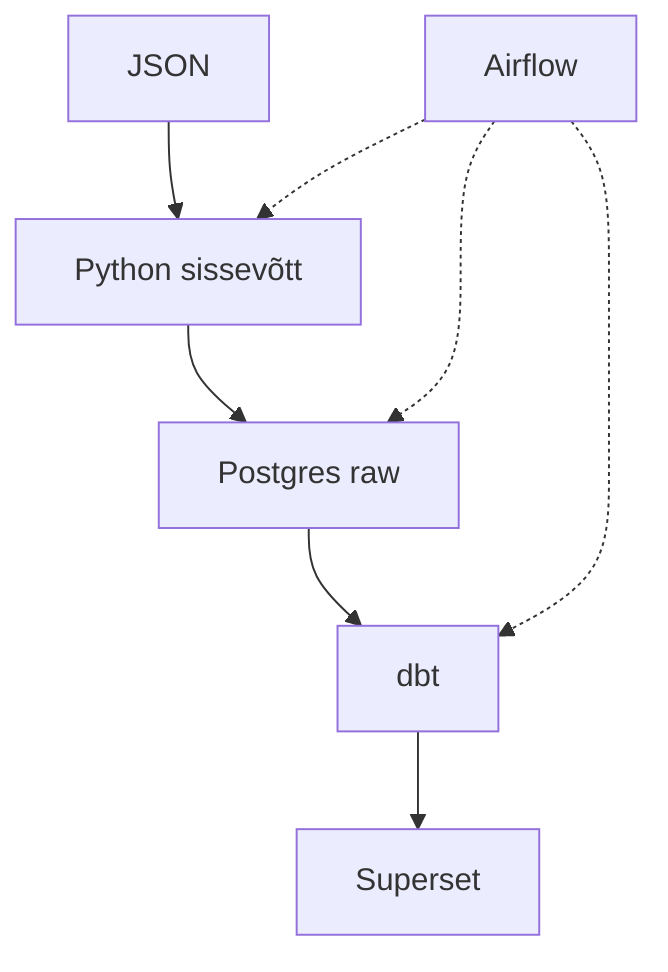

# Vahekohtumehhanismid Euroopa Komisjoni koondumisotsustes

Alates 2000. aastate algusest on Euroopa Komisjon oma tingimuslikes koondumisotsustes kasutanud vahekohtuklausleid. Nende puhul on võimalik, et koondunud ettevõtte kohustuste jõustamine ei ole tegelikkuses konkurentide jaoks võimalik või viib kuluka protsessini.  

Antud projekt ehitab Euroopa Komisjoni avalike koondumisotsuste andmestiku põhjal andmevoo vahekohtuklauslite statistika kuvamiseks dashboardile.  

## Äriküsimus
  
Mitmes vaadeldava perioodi Euroopa Komisjoni tingimuslikus koondumisotsuses (artiklid 6(1)(b) ja 8(2)) on kaalutud tingimuste jõustamiseks vahekohtumehhanismi ning milline on selliste otsuste sektoraalne jaotuvus ja trend (NACE-koodide alusel).  

Kasu tõuseb: 

•	teadlastele, kuna seda andmestikku sellise granulaarsusega seni ei eksisteeri (tuleb sadu pdfe käsitsi avada ja analüüsida); 

•	investoritele investeeringut plaanides riskide hindamiseks (nt kas tingimuste üle tekkivad vaidlused on pigem avalikud või konfidentsiaalsed; kas võimalik vaidluste lahendamise mehhanism ise võib olla Euroopa õigusega vastuolus);

•	turuosalistele, sh VKE-dele, Komisjoni koondumismenetluse raames turu-uuringule vastates vaidluste lahendamise mehhanismi osas teadlike valikute tegemiseks; 

•	regulaatoritele hindamaks vahekohtuklauslite kasutamise sagedust ja selle praktika võimaliku muutmise eeldatavat mõju kogu Euroopa turule ja selle eri sektoritele.

**Mõõdikud:**

1. Kalendrikuu või slideriga valitud muu perioodi tingimuslikult heakskiitvates koondumisotsustes vahekohtumehhanismi mainimine, jah/ei näitaja.  
2. Vahekohtumehhanismi mainivate otsuste koguarv ja osakaal kõigist tingimuslikult heakskiitvatest otsustest kuude/aastate lõikes.  
3. Millistes NACE tegevusalades on kaalutud vahekohtumehhanismi?  
4. Milline on trend tegevusalati kuude/aastate/muu valitud perioodi lõikes?  


## Arhitektuur


```mermaid
flowchart TB
    ec[JSON]
    py[Python sissevõtt]
    raw[Postgres raw]
    dbt[dbt]
    ss[Superset]
    af[Airflow]

    ec --> py --> raw --> dbt --> ss
    af -.-> py
    af -.-> raw
    af -.-> dbt
```

Täpsem kirjeldus: [`docs/architecture.md`](docs/architecture.md) · [`docs/data_pipeline.md`](docs/data_pipeline.md)


## Andmestik

| Allikas | Tüüp | Uuendamine | Roll |
|---------|------|--------------|------|
| https://compcases-open-data-portal-files-prod.s3.eu-west-1.amazonaws.com/case-data-M.json |JSON | Uueneb otsuste/info lisandumisel (fail uueneb iga päev, kuna tavaliselt lisandub iga kuu mitukümmend otsust - nt 27. mai 2026 seisuga on viimasel kuul Komisjon teinud koondumistes 37 menetluses uusi otsuseid) | Algallikas |


## Stack

| Komponent | Tööriist |
|-----------|---------|
| Sissevõtt | Python |
| Transformatsioon | dbt Core 1.10 |
| Andmehoidla | PostgreSQL (pgDuckDB) |
| Näidikulaud | Apache Superset 6.x |
| Orkestreerimine | Apache Airflow 3.x  |


## Käivitamine

Pikem käskude nimekiri (käsitsi sammud, andmete analüüs, dbt, Superset, restart): [`docs/run_commands.md`](docs/run_commands.md)

```bash
# Keskkond
cp .env.example .env

# Kõik teenused (db, python, dbt, superset, airflow-init, Airflow UI + scheduler)
docker compose up -d --build
docker compose ps   # oota "healthy" / "running" (esimene Airflow init võtab mõne minuti)

# Pipeline — Airflow
# UI: http://localhost:8080  (login: .env → AIRFLOW_ADMIN_USER / AIRFLOW_ADMIN_PASSWORD)
# Lülita sisse ja käivita DAG "eu_merger_arbitration" (iga päev 03:00; esimesel korral loob raw tabelid, laadib JSON/PDF-id, dbt, CSV)
# Kiire test 100 PDF-i töötlemiseks: DAG "eu_merger_arbitration_test"

# Valikuline: andmebaas
docker compose exec db psql -U user -d eu-merger-arbitration

# Peatamine
docker compose down
```
