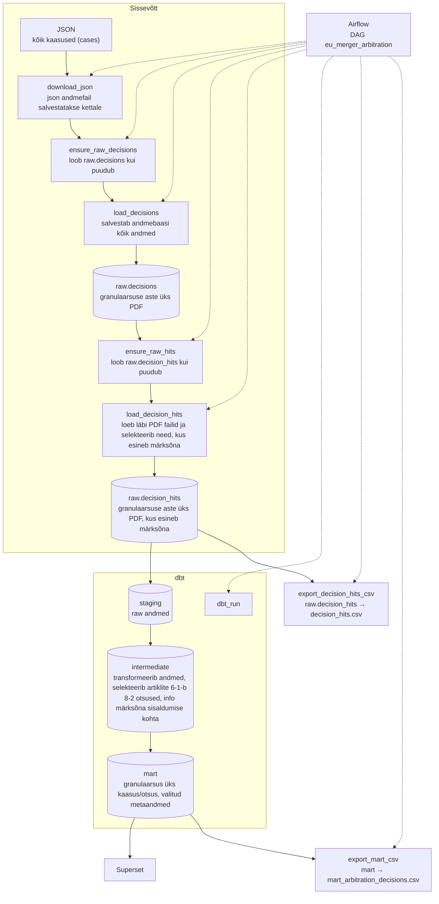

# Arhitektuur

## Äriküsimus

Mitmes vaadeldava perioodi Euroopa Komisjoni tingimuslikus koondumisotsuses (artiklid 6(1)(b) ja 8(2)) on kaalutud tingimuste jõustamiseks vahekohtumehhanismi ning milline on selliste otsuste sektoraalne jaotuvus ja trend (NACE-koodide alusel)? 

## Mõõdikud

1. Kalendrikuu või slideriga valitud muu perioodi tingimuslikult heakskiitvates koondumisotsustes vahekohtumehhanismi mainimine, jah/ei näitaja.  
2. Vahekohtumehhanismi mainivate otsuste koguarv ja osakaal kõigist tingimuslikult heakskiitvatest otsustest kuude/aastate lõikes.  
3. Millistes NACE tegevusalades on kaalutud vahekohtumehhanismi?  
4. Milline on trend tegevusalati kuude/aastate/muu valitud perioodi lõikes?  

## Andmeallikad

| Allikas | Tüüp | Andmete uuendamine | Roll |
|---------|------|--------------|------|
| https://compcases-open-data-portal-files-prod.s3.eu-west-1.amazonaws.com/case-data-M.json |JSON | Uueneb otsuste/info lisandumisel (fail uueneb iga päev, kuna tavaliselt lisandub iga kuu mitukümmend otsust - nt 27. mai 2026 seisuga on viimasel kuul Komisjon teinud koondumistes 37 menetluses uusi otsuseid) | Algallikas |
Kirjeldus andmestikust ja selle kasutusest: 

Euroopa Komisjoni avaandmed: igal (töö?)päeval uuenev JSON-fail koondumisotsustega al 1990, saadaval ülaloleval lingil. Kasutatakse tingimuslikult heakskiitvate otsuste (st nii 1989 kui 2004 koondumismääruse Art 6(1)(b) või Art 8(2) all tehtud otsuste) pdf-ides sõnaotsingute alusel selliste menetluste tulemustena reastamiseks, milles on kaalutud tingimuste jõustamiseks vahekohtumehhanismi. Salvestame nende menetluste kohta ka metaandmeid, et võimaldada hiljem üksikasjalikumat analüüsi otsustest, nende ajaloost ja trendidest. 

## Andmevoog

Skeem: ELT — avaandmetes sisalduvad Komisjoni otsused on avalikud (ei sisalda ärisaladust ega isikuandmeid).

Detailne kirjeldus: [`data_pipeline.md`](data_pipeline.md)

Tööriistad: Python, PostgreSQL, dbt Core, Superset (test). Orkestreerimine: Airflow.

## Andmebaasi kihid

| Kiht | Roll |
|------|------|
| `raw` | Algallikast laetakse andmebaasi kõik andmed ja märksõnu sisaldavate PDF failide andmed. |
| `dbt staging` | Andmebaasist raw andmed töötlemata kujul. |
| `dbt intermediate` | Transformeerib andmeid ja rakendab äriloogikat. |
| `dbt marts` | Dashboardi tabelid (nt `mart_arbitration_decisions`). |

## Tööjaotus

| Roll | Vastutus | Täitja |
|------|----------|--------|
| Andmeallika omanik | Kirjutab sissevõtu ja uuendamise loogika | Katrin (kood); Riina (ekspertiis andmeallika sisu reaalelu vastete osas – nt mis sätete all vastu võetud otsuseid üldse otsida ja lugeda; andmekvaliteedi vigade osas ennetavad meetmed (nt teostada sõnaotsing nii vanilje-Art 8(2) kui Art 8(2) with conditions and obligations alla pesastatud otsustest, kuna 8(2) ilma tingimusteta on haruharv ja testotsingu alusel näeme, et vanilje-8(2)-na pesastatud otsustes on vahel ikkagi tingimused ja kohustused sees.)) |
| Transformatsioonide omanik | Kirjutab intermediate ja mart kihi mudelid ning mõõdikute arvutuse | Riina (äripoole disain, sh otsisõnad kõigis EU 24 ametlikus keeles), Katrin (kood) |
| Kvaliteedi omanik | Testid ja kontroll | Vahur, Toivo |
| Näidikulaua omanik | Ehitab näidikulaua ja seob selle äriküsimusega | Riina |

## Riskid

| Risk | Mõju | Maandus |
|------|------|---------|
| Euroopa Komisjoni lehekülg, kust andmed laetakse, ei ole ligipääsetav | Andmeid ei saa uuendada | Uuendamist korratakse, backfill
| Andmefaili struktuur on muutunud | Ei leia vajalikke väärtusi üles | Dünaamiline schema, faili struktuuri kontroll, muutustest teavitamine |
| Scheduler ei käivitu, andmed ei värskendu automaatselt | Saame päringust vananenud väärtused | Logide kontrollimine |
| Märksõnade täpsus | Valepositiivsed / valenegatiivsed | `keywords.txt` kontroll |

## Privaatsus ja turve

Andmeallikas on avalik.  Selle sisu ei sisalda ärisaladusi ega isikuandmeid, kuna need eemaldab Komisjon enne otsuste avaldamist.  
Andmebaasi paroolid salvestatakse `.env` faili.
